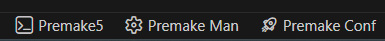

# premake manager

> A modern CLI and VS Code extension to orchestrate Premake versions, modules, and libraries via automated Terminal Profiles and an **Interactive Command Loop**.

---

**premake manager** simplifies the management of the Premake ecosystem. It integrates directly into the VS Code UI, providing specialized terminal environments that launch the correct context and remain active for continuous use.

## 🚀 Key Features

* **Interactive Command Loop**: The Manager terminal stays open and ready. Once inside, you can enter commands directly without the `premake manager` prefix.
* **Automated Terminal Profiles**: No manual path setup required. Launch pre-configured shells for both Premake execution and Manager administration.
* **Quick-Access Shortcuts**: Use `CTRL+ALT+M` for the Quick Menu or `CTRL+ALT+P` to jump straight into the Manager CLI terminal.
* **Module & Library Ecosystem**: Effortlessly discover, install, and update Premake modules and C/C++ libraries.
* **Workspace Orchestration**: Generate complex workspace and project structures via the `workspace new` wizard.

---

## ⚡ VS Code Integration

### Keyboard Shortcuts
| Shortcut         | Action                                                      |
| :--------------- | :---------------------------------------------------------- |
| `CTRL + ALT + M` | Opens the **Premake Manager Quick Menu** (Command Palette). |
| `CTRL + ALT + P` | Launches/Focuses the **Premake Manager CLI Terminal**.      |

### Status Bar Actions
The Status Bar buttons act as smart launchers for your development environment:



* **Premake5**: Launches a dedicated **Premake5 Terminal Profile**. Use this for running your `premake5` commands with the correct version automatically in your PATH.
* **Premake Man**: Launches the **Premake Manager Interactive Terminal** (`CTRL+ALT+P`). Enter commands like `library add` directly without re-typing the prefix.
* **Premake Conf**: Launches the Interactive Terminal and immediately executes `config view` to display your current environment state.

---

## 🛠 Usage in Terminal

By using the integrated Terminal Profiles, you stay in the flow without jumping between different shell instances.

### Interactive Mode
When you launch the Manager Terminal, you enter a persistent session. You do **not** need to type `premake manager` before every command.

```bash
# Inside the Interactive Premake Manager Terminal:
version list --releases
workspace new
library info <githublink>

# To close the session and return to your standard shell:
exit
```

```bash
# In the Premake5 Terminal:
premake5 gmake2
```

---

## Command Groups

The interface is organized into the following eight functional groups:

| Group           | Description                                                   |
| :-------------- | :------------------------------------------------------------ |
| **`config`**    | Manage `premakeConfig` settings and environment variables.    |
| **`version`**   | `Manage` and `switch` between different Premake versions.     |
| **`workspace`** | Create, configure, and manage Premake workspaces.             |
| **`module`**    | Handle the `installation` and `lifecycle` of Premake modules. |
| **`library`**   | Manage `external Premake libraries` and `dependencies`.       |
| **`index`**     | All commands for managing the common discovery index.         |
| **`remotes`**   | Manage locally configured remote repositories and sources.    |
| **`test`**      | Run the Premake Manager self-test suite to verify integrity.  |

---

> [!NOTE] Because the extension mirrors the CLI, any command available in your terminal is accessible through the VS Code command palette under the same group naming convention.