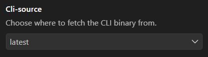
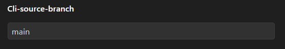

# cli

## settings

The extension provides certain [User Settings](https://code.visualstudio.com/docs/configure/settings#_user-settings).

these can be found by typeing: `premake manager` in the settings search bar

### Source

| option   | description                                       |
| -------- | ------------------------------------------------- |
| latest   | Use tha latest release                            |
| Artifact | Download the latest artifact from the main branch |

### Artifact Source branch

This settting determines wich branch the artifact will be downloaded from.

> [!NOTE] artifacts are not persistent so they can only be downloaded for a certain period!

