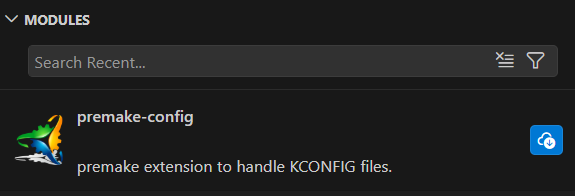
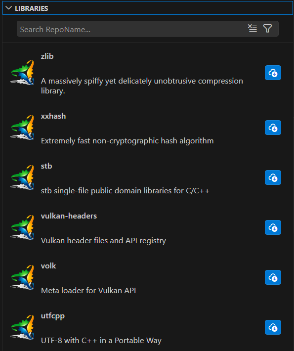

# ativity bar

- [modules](#1-modules-view)
- [libraries](#2-libraries-view)

> [!NOTE] the `modules` and `libraries` are porivded bye the **unnoficial** [registry](https://premake-registry-ywxg.onrender.com/)

## 1 modules view

> [!NOTE] the blue install button can be used to add the library to the config

## 2 libraries view

> [!NOTE] the blue install button can be used to add the library to the config
