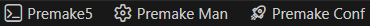
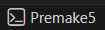
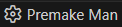
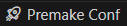

# status bar

- [premake5 terminal](#1-premake5-terminal)
- [premamek manager terminal](#2-premake-manager-terminal)

## 1 premake5 terminal

using this `status bar action` you can quickly `launch` a `premake5 terminal`.

this automatically uses the version set using the version command group.

> [!WARNING] even tough the path variable is set by the cli a special terminal profile is needed due to a long standing bug in vscode

## 2 premake manager terminal

this `status bar action` launches the interactive premake manager terminal.

## 3 premake manager configure

this `statuse bar action` configures the workspace: IE install and set the version set in the `premakeConfig.yml`, and installing **modules**, **libraries**.
